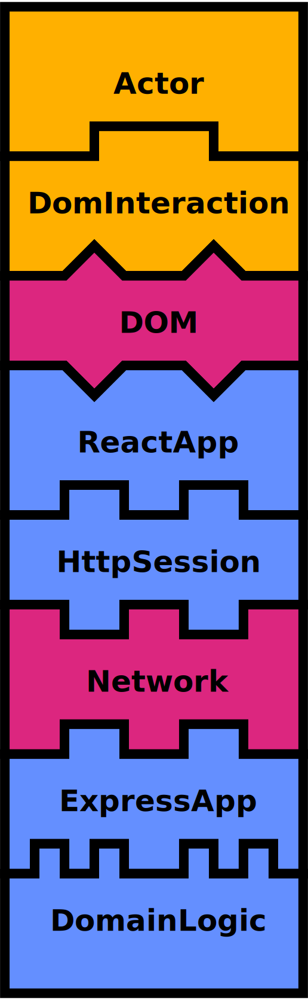
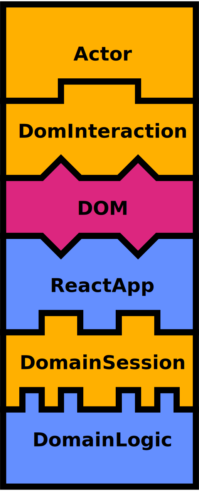
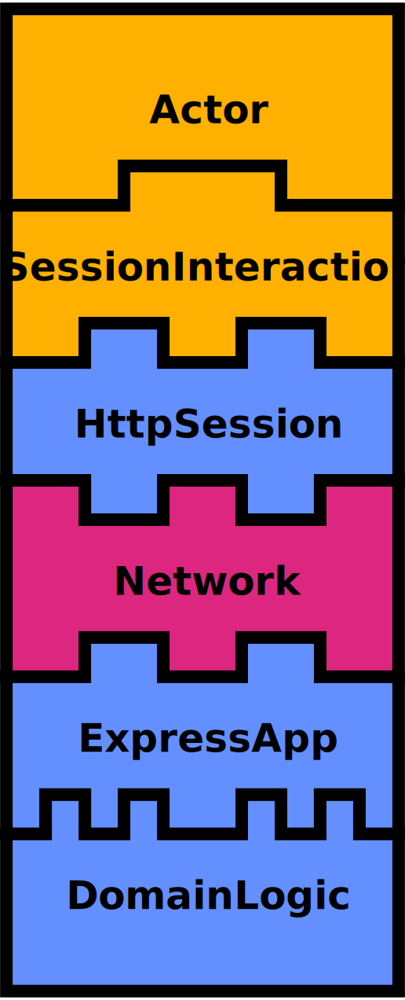
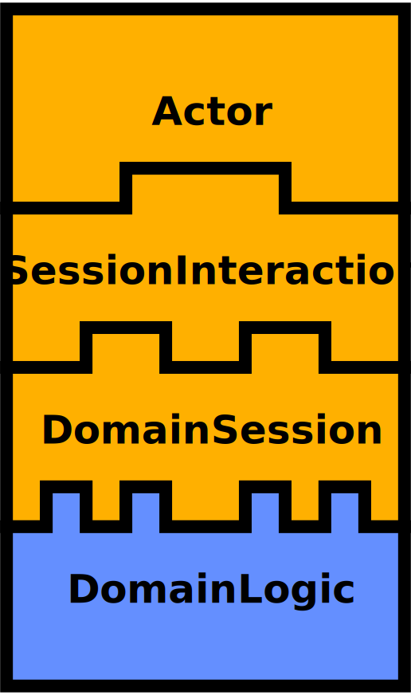

# @cucumber/playwright

[](https://github.com/cucumber/playwright.js/actions/workflows/ci.yml)

Cucumber Playwright is a small library for [Cucumber.js](https://github.com/cucumber/cucumber-js/) that enables better 
acceptance tests (Gherkin Scenarios):

* 🚅 Full-stack acceptance tests that run in **milliseconds**
* 🔓 Encourages loosely coupled system components that are easier to test in isolation  
* 🧩 Assembles system components in several ways, so you can optimize for **speed** or **test coverage**
* 📗 Readable scenarios that describe the **what** instead of the **how** 
* 🧰 Maintainable automation code

See the [credits](#credits) section for details about prior work that inspired this library.

When you use Cucumber Playwright, your step definitions are typically one-liners:

```typescript
When('{actor} logs in successfully', async function (actor: Actor) {
  await actor.attemptsTo(logIn(`${actor.name}@test.com`, 'valid-password'))
})
```

You can provide several implementations of `logIn` - one that interacts with the user interface, but *also* one that
interacts with the API layer *underneath* the user interface via direct function calls or HTTP requests.

This forces you to avoid UI language in your scenarios like "fill in field" and "click button", because it doesn't make
sense to do that in a `logIn` implementation that isn't using the UI. Likewise, it forces you to avoid using HTTP 
language like "execute HTTP POST /login", because it doesn't make sense to do this in the `logIn` implementation that 
uses the UI.

These constraints encourage you to write *readable* scenarios that describe *what users can do* rahter than 
*how your system is implemented*. Your scenarios become living documentation that can be understood by everyone on 
the team.

## Assemblies

With Cucumber Playwright you can evolve an acceptance test suite that you can run with multiple configurations, or 
*assemblies*. The [assembly diagrams](https://github.com/subsecondtdd/assembly-diagrams#readme) below
illustrate how:

*  Test components
*  Infrastructure components
*  Production components

| DOM-HTTP-Domain                                | DOM-Domain                           | HTTP-Domain                            | Domain                       |
| ---------------------------------------------- | ------------------------------------ | ---------------------------------------| ---------------------------- |
|  |  |  |  |

## Installation

First, add the library to your project:

    npm install @cucumber/playwright --save-dev

## Usage

This guide will walk you through the usage of the `@cucumber/playwright` step by step. For a full example, please refer 
to the files in the `features` directory (which are also acceptance tests for this library).

### Actors

The central concept in `@cucumber/playwright` is the `Actor`. An actor object represents a user interacting with the
system.

In order to access actor objects from your step definitions, you first need to define an `{actor}` 
[parameter type](https://cucumber.io/docs/cucumber/cucumber-expressions/#parameter-types). 

Create a file called `features/support/World.ts` (if you haven't already got one) and add the following code: 

```typescript
import { defineParameterType, setWorldConstructor } from '@cucumber/cucumber'
import { ActorWorld, ActorParameterType } from '@cucumber/playwright'

// Define an {actor} parameter type that creates Actor objects
defineParameterType(ActorParameterType)

// Define your own World class that extends from ActorWorld
export default class World extends ActorWorld {
}
setWorldConstructor(World)
```

Your step definitions will now be passed `Actor` objects for `{actor}` parameters, for example:

```gherkin
When Martha logs in
```

```typescript
When('{actor} logs in', async function (actor: Actor) {
  // The logIn() function is an Interaction
  await actor.attemptsTo(logIn(`${actor.name}@test.com`, 'valid-password'))
})
```

Keep reading to learn how to define *Interactions*.

### Interacting with the system

Now that your step definitions can be passed `Actor` objects, we need to define `Interaction`s that the actor can use
to *interact* with the system.

An interaction is a function that returns another function that expects an `Actor` parameter.

Add the following to `features/support/interactions/logIn.ts`: 

```typescript
type LogIn = (email: string, password: string) => Interaction<Promise<string>>

export const logIn: LogIn = (email, password) => {
  return async (actor: Actor) => {
    // Just a dummy implementation for now - we'll come back and flesh this out later
    return '42'
  }
}
```

Back in the step definition we can now import this interaction:

```typescript
import { logIn } from '../support/interactions/logIn'

When('{actor} logs in', async function (actor: Actor) {
  const userId = await actor.attemptsTo(logIn(`${actor.name}@test.com`, 'valid-password'))
})
```

#### Interactions and Questions

In addition to `Actor#attemptsTo` there is also an `Actor#ask` method. It has exactly the same signature
and behaviour as `Actor#attemptsTo`. It often makes your code more readable if you use `Actor#attemptsTo`
in your `When` step definitions that *modify* system state, and `Actor#ask` in `Then` step definitions
that *query* system state.

For example:

```typescript
export type InboxMessages = () => Interaction<readonly string[]>

export const inboxMessages: InboxMessages = (userId) => {
  return (actor: Actor) => {
    return ['hello', 'world'] 
  }
}
```

And in the step definition:

```typescript
import { inboxMessages } from '../support/interactions/inboxMessages'

Then('{actor} should have received the following messages:', function (actor: Actor, expectedMessages: DataTable) {
  const receivedMessages = actor.ask(inboxMessages())
  assert.deepStrictEqual(receivedMessages, expectedMessages.rows.map(row => row[0]))
})
```

### Using different interaction implementations

It can often be useful to have multiple implementations of the same interaction. This allows you
to build new functionality incrementally with fast feedback.

For example, you might be working on a new requirement that allows users to log in. You can start
by building just the server side domain logic before you implement any of the HTTP layer or UI around it and get 
quick feedback as you progress.

Later, you can run the same scenarios again, but this time swapping out your interactions with implementations
that make HTTP requests or interact with a DOM - without changing any code.

If you look at the [shouty example included in this repo](./features), you will see that we organized 
our interactions in two directories:

```
features
├── hear_shout.feature
└── support
    └── interactions
        ├── dom
        │   ├── inboxMessages.ts
        │   ├── moveTo.ts
        │   └── shout.ts
        └── session
            ├── inboxMessages.ts
            ├── moveTo.ts
            └── shout.ts
```

In order to decide at run-time what interaction implementations to use, you can use the *interaction loader* provided 
in `@cucumber/playwright`:

```typescript
import { setWorldConstructor } from '@cucumber/cucumber'
import { ActorWorld, defineActorParameterType, Interaction } from '@cucumber/playwright'
import { InboxMessages, Shout, StartSession } from './interactions/types'

export default class World extends ActorWorld {
  public startSession: StartSession
  public shout: Shout
  public inboxMessages: InboxMessages
}
setWorldConstructor(World)

Before(async function (this: World) {
  // Loads this.startSession, this.shout and this.inboxMessages
  await this.loadInteractions()
})
```

The `await this.interaction(...)` calls will load the interation implementation from one of the two directories based on 
the value of the `interactions` [world parameter](https://github.com/cucumber/cucumber-js/blob/main/docs/support_files/world.md#world-parameters),
defined in the `./cucumber.js` config file.

If you're using this technique, you also need to adapt your step definitions to reference interactions from the 
*world* (`this`):

```typescript
When('{actor} shouts {string}', async function (this: World, actor: Actor, message: string) {
  await actor.attemptsTo(this.shout(message))
})
```

### Sharing data between steps

Your actors have the abililty to `remember` and `recall` data between steps. For example:

```typescript
When('{actor} logs in', async function (actor: Actor<World>) {
  const userId = await actor.attemptsTo(logIn(`${actor.name}@test.com`, 'valid-password'))
  actor.remember('userId', userId)
})

Then('{actor} should be logged in', function (actor: Actor) {
  assert.ok(actor.recall('userId'))
})
```

You can also pass a function to `remember` to memoize a value:

```typescript
function getSomething(actor: Actor) {
  actor.recall('something', () => ({ foo: 'bar' }))
}

// The same object is returned every time
assert.strictEqual(getSomething(actor), getSomething(actor))
```

**Note:** the data remembered is scoped by `Actor`, so you cannot access data remembered by one actor from another 
one. You can have multiple actors storing different data with the same key. Every `Actor` is discarded at the end of
each scenario, so you won't be able to `recall` anything from previous scenarios.

### Accessing the world from actors

If your interactions need to access data in the `world`, they can do so via the `Actor#world` property. If you're 
doing this you should also declare the generic type of the actor in the interaction implementation:

```typescript
export const moveTo: MoveTo = (coordinate) => {
  // We're declaring the World type of the actor so that we can access its members
  return async (actor: Actor<World>) => {
    actor.world.shouty.moveTo(actor.name, coordinate)
  }
}
```

### Asynchronous behaviour and eventual consistency

In a distributed system it may take some time before the outcome of an action propagates around the whole system.

For example, in a chat application, when one user sends a message, it may take a few milliseconds before the 
other users receive the message, because it travels through a network, even when it's all on your machine.

In cases like this you can use the `eventually` function to periodically check for a specific condition:

```typescript
Then('{actor} hears {actor}’s message', async function (this: World, listener: Actor<World>, shouter: Actor) {
  const shouterLastMessage = shouter.recall('lastMessage')

  await eventually(() => {
    const listenerMessages = listener.ask(this.inboxMessages())
    assert.deepStrictEqual(listenerMessages, [shouterLastMessage])
  })
})
```

The `eventually` function accepts a single argument - a zero argument `condition` function. If the `condition` function 
throws an error, it will be called again at a regular `interval` until it passes without throwing an exception. 
If it doesn't pass or finish within a `timeout` period, a timeout error is thrown.

The default `interval` is `50ms` and the default `timeout` is `1000ms`. This can be overridden with a second 
`{ interval: number, timeout: number }` argument after the `condition`.

## Advanced Configuration

Below are some guidelines for more advanced configuration.

### Using Promises

The default type of an `Interaction` is `void`. If your system is asynchronous
(i.e. uses `async` functions that return a `Promise`), you can use the `PromiseInteraction`
type instead of `Interaction`.

### Using an explicit ActorLookup

If you cannot extend `ActorWorld`, you can add an `ActorLookup` field to your existing world class like so:

```typescript
import { ActorLookup } from '@cucumber/playwright'

class World {
  private readonly actorLookUp = new ActorLookup()

  public findOrCreateActor(actorName: string): Actor<World> {
    return this.actorLookUp.findOrCreateActor(this, actorName)
  }
}
```

### Overriding ActorParameterType options

The `defineParameterType(ActorParameterType)` function call defines a parameter type named `{actor}` by default,
and it uses the RegExp `/[A-Z][a-z]+/` (a capitailsed string).

If you want to use a different name or regexp, you can override these defaults:

```typescript
defineParameterType({ ...ActorParameterType, name: 'acteur' })
defineParameterType({ ...ActorParameterType, regexp: /Marcel|Bernadette|Hubert/ })
defineParameterType({ ...ActorParameterType, name: 'acteur', regexp: /Marcel|Bernadette|Hubert/ })
```

## Design recommendations

When you're working with `@cucumber/playwright` and testing against multiple layers, we recommend you use only two
interaction implementations:

* `dom` for interactions that use the DOM
* `session` for interactions that use a `Session`

A `Session` represents a user (actor) having an interactive session with your system. A `Session` will typically be used 
in two places of your code:

* From your `session` interactions
* From your UI code (React/Vue components etc)

`Session` is an interface that is specific to your implementation that you should implement yourself. Your UI code 
will use it to interact with the server. This separation of concerns prevents network implementation details to
bleed into the UI code.

You'll typically have two implementations of your `Session` interface - `HttpSession` and `ShoutySession`.

The `HttpSession` is where you encapsulate all of the `fetch`, `WebSocket` and `EventSource` logic. This is the class
your UI will use in production. You will also use it in tests.

The `ShoutySession` is an implementation that talks directly to the server side domain layer with direct function calls
(without any networking). This implementation will only be used in tests.

By organising your code this way, you have four ways you can run your Cucumber Scenarios.

* `session` interactions using `ShoutySession` (fastest tests, domain layer coverage)
* `session` interations using `HttpSession` (slower tests, http + domain layer coverage)
* `dom` interactions using `ShoutySession` (slower tests, UI + domain layer coverage)
* `dom` interactions using `HttpSession` (slowest tests, UI + http + domain layer coverage)

In the example we use [world parameters](https://github.com/cucumber/cucumber-js/blob/main/docs/support_files/world.md#world-parameters)
to control how to interact with the system and how the system is assembled.

## Credits

This library is inspired by the *Playwright* pattern.

* [Beyond Page Objects: Next Generation Test Automation with Serenity and the Playwright Pattern](https://www.infoq.com/articles/Beyond-Page-Objects-Test-Automation-Serenity-Playwright/) by Andy Palmer, Antony Marcano, John Ferguson Smart and Jan Molak
* [Serenity/JS](https://serenity-js.org) - the first JavaScript/TypeScript implementation of the Playwright pattern by Jan Molak
* [Playwright Pattern](https://serenity-js.org/handbook/thinking-in-serenity-js/Playwright-pattern.html) as described by Jan Molak
* [Understanding Playwright](https://cucumber.io/blog/bdd/understanding-Playwright-(part-1)/) - blog series by Matt Wynne

This library aims to provide a gentler learning curve than the original Playwright pattern, so some concepts like
*abilities* and *tasks* have been left out.
